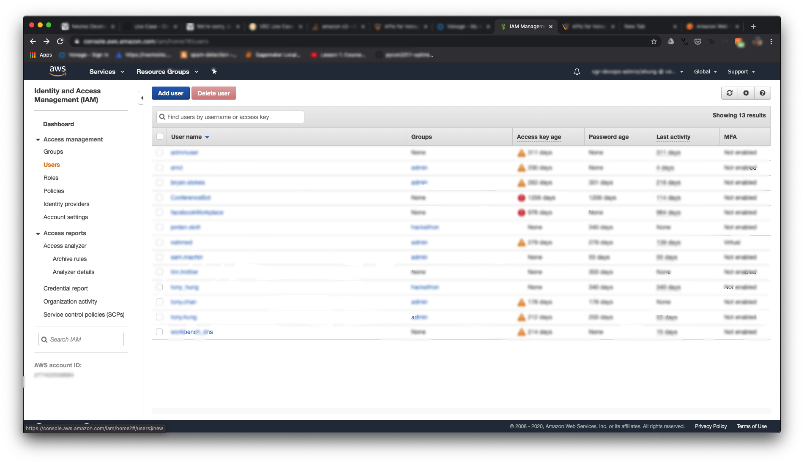
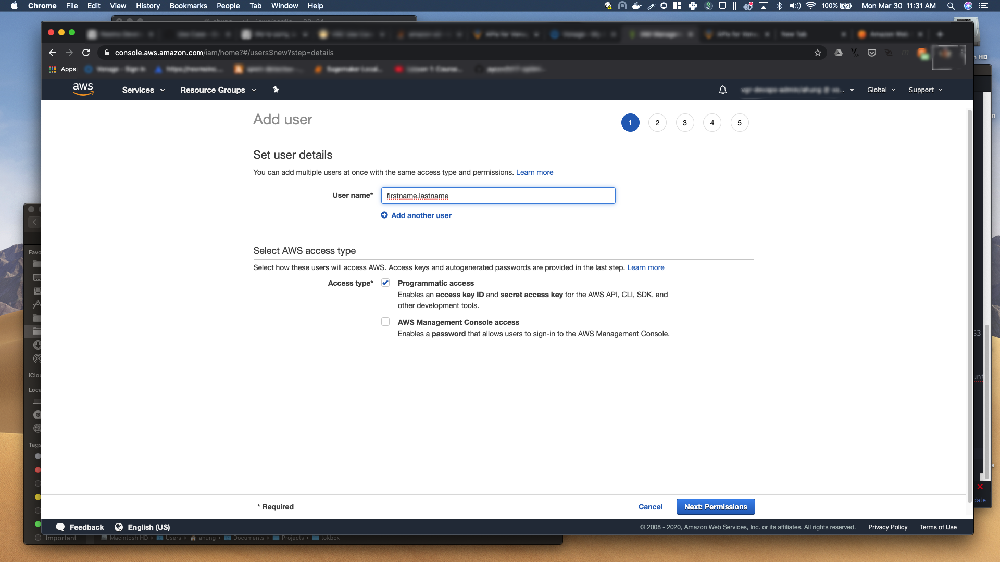

title: Save Call Recordings to Amazon S3
navigation_weight: 1
---

In this tutorial, we will show how to save Vonage Business Cloud recordings to Amazon S3. There are many examples of how why this would be done:
* Save Recordings as a backup.
* Use Amazon Transcribe to transcribe Recordings.
* Analyze call recordings into dashboards.
and many more.

For this example, we will be building our example in Python. However, you can use any language that your most comfortable with. We'll be using the following Python libraries:
* [requests](https://requests.readthedocs.io/en/master/)
* [boto3](https://boto3.amazonaws.com/v1/documentation/api/latest/index.html)

# Prerequisites
Before you can get started, you will need to have Vonage Developer account. If you do not have a Vonage Developer account, please use this [guide](_documentation/en/concepts/guides/create-a-developer-account.md) in order to setup and create your account.
After you have an account, you will need to do the following using these guides:
* [Create an application](_documentation/en/concepts/guides/create-an-application.md).
* [Subscribe to the API's](_documentation/en/concepts/guides/create-an-application.md).

For this example, you will need to Subscribe to the [Call Recording API](_documentation/en/call-recording/overview.md).

#Authentication
After creating an application and subscribing to the Call Recording API, you will now need to log in using your Vonage Business Cloud credentials. For our application, we will be using the Requests library to call the `/api/accounts/` API. Check out the [Making an API Request guide](_documentation/en/concepts/guides/make-an-api-request.md) for more details.

Next, we'll create a function that requests the `/api/accounts` API to generate an access token.

```Python
def get_token():
  url = "https://api.vonage.com/token"
  payload = 'grant_type=password&username={}&password={}&client_id={}&client_secret={}'.format(USERNAME, PASSWORD, CLIENT_ID, SECRET)
  headers = {
    'Content-Type': 'application/x-www-form-urlencoded'
  }

  response = requests.request("POST", url, headers=headers, data = payload)
  return response.json()
  ```

  To run this function, you will need to pass in the following:
  * USERNAME - Vonage Business cloud username. Be sure to append `@vbc.prod` to the username. `firstname.lastname@vbc.prod`.
  * PASSWORD - Vonage Business Cloud password.
  * CLIENT_ID - The client id of your Vonage Developer application.
  * SECRET - The secret to your Vonage Developer application.

  After running this function, you should see the following response:
  ```
  {'access_token': 'abc123-xxxxx-xxxxx',
 'expires_in': 9999,
 'refresh_token': 'def456-xxxx-xxxx',
 'scope': 'default',
 'token_type': 'Bearer'}
 ```

 Next, we'll request the Call Recording API and use the `access_token` that was returned from the `get_token` function. This will return a JSON response of the call recordings.

 ```Python
 def get_company_call_recordings(token, account_id="self"):
  url = "https://api.vonage.com/t/vbc.prod/call_recording/v1/api/accounts/{}/company_call_recordings".format(account_id)

  headers = {
    'Accept': 'application/json',
    'Authorization': 'Bearer {}'.format(token),
  }

  response = requests.request("GET", url, headers=headers)
  return response.json()
  ```

Here, we are calling the `call_recording/v1/api/` and passing the following parameter:
* `account_id` - The Vonage Business Communications account ID. You can use 'self' to refer to the authenticated user's account.
The Call Recording API supports many more parameters that can be used to filter your recordings. For example, you can filter recordings by length of recording using `duration:gte` and `duration:lte`. Check out the API docs for all available parameters.

The `get_company_call_recordings` function should return a list of recordings from the account. Next, we'll create a function to retrieve the recording.

```Python
def download_recording(token, recording_url):
  headers = {
    'Accept': 'application/json',
    'Authorization': 'Bearer {}'.format(token),
  }

  response = requests.request("GET", recording_url, headers=headers)
  return response.content
```
This function takes the recording from the `download_url` parameter and returns the raw data of the recording.

To upload the recording to S3, we'll need to configure Boto3.

# Boto3

Boto3 is a package from AWS that allows you to perform most, if not all of the available tasks pragmatically. To use boto3, you will need to first have an AWS account and be able to generate an access key and secret. Navigate to your AWS instance and go to [IAM](https://console.aws.amazon.com/iam/home).

Under `Access Type`, select `Programmatic access`

Write down (in a secure location) the newly created access key and secret.

Finally, To upload files into S3, you will need to create an S3 bucket. Navigate to [AWS S3](https://s3.console.aws.amazon.com/) and click `Create Bucket`.


In the `Bucket Name` field, enter a unique name for the bucket. At the bottom of the page, uncheck the `Block all public access` checkbox. Since we are using the boto3 client, we need to have the correct permissions on uploading objects to our bucket. Please do not do this for production. Instead, create a new IAM role and add the permissions appropriately.


To use the Boto3 library, we need to install it using `pip`.
In your Linux terminal Type:
```bash
pip install boto3
```

Next, create an S3 client in boto3 and provide the newly created keys:
```Python
import boto3
client = boto3.client(
    's3',
    aws_access_key_id=AWS_ACCESS_KEY_ID,
    aws_secret_access_key=AWS_ACCESS_KEY_SECRET
)
```
Next, we'll loop thought all the recordings from the `get_company_call_recordings` function we created earlier.
Then, for each recording, we'll use the `download_recording` function to get the raw data of the recording. We could have saved the recording to a file, but since we are uploading to s3, there's no need to save it locally, then upload it to S3.

```Python
for recording in recordings["_embedded"]["recordings"]:
  downloaded_recording = download_recording(token,recording["download_url"])
  client.put_object(Bucket="{MY_BUCKET}",
                       Key=recording["file_name"],
                       Body=downloaded_recording)
```
[client.put_object](https://boto3.amazonaws.com/v1/documentation/api/latest/reference/services/s3.html#S3.Client.put_object) is a boto3 function that uploads the raw data to the S3 bucket. This function accepts the following parameter:
* Bucket - The name of your newly created bucket.
* Key - The name of the file. For this example, we will use the `file_name`, which is returned to us from the `company_call_recordings` API.
* Body - The raw binary data of the file

After a few minutes or so, depending on how many files you will, your files will be uploaded to S3


# Conclusion
From this example, we've shown how you can backup all your Vonage Business Cloud company call recordings into an S3 bucket. There are other ways to improve this by only downloading calls for the current day. Also, if you want to get fancy, you can create a [Cron Job](https://www.ostechnix.com/a-beginners-guide-to-cron-jobs/) to run every day to download the recordings.
